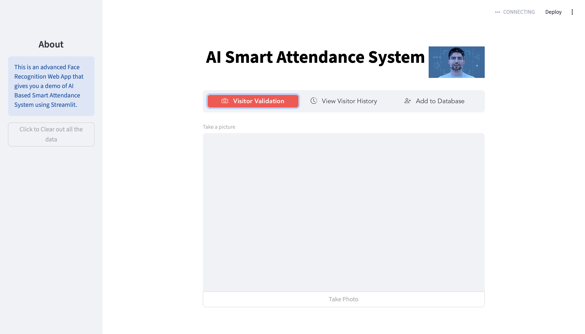
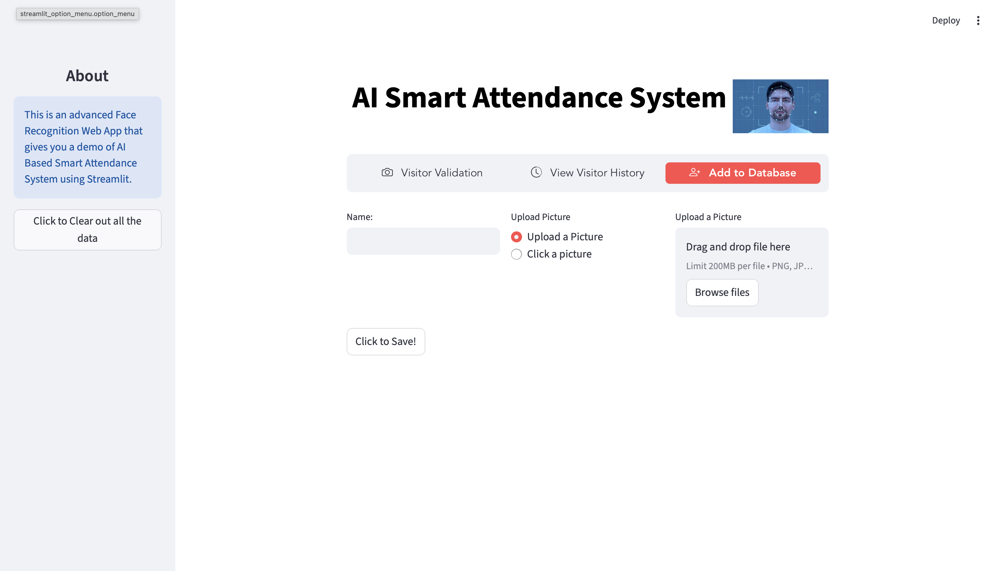
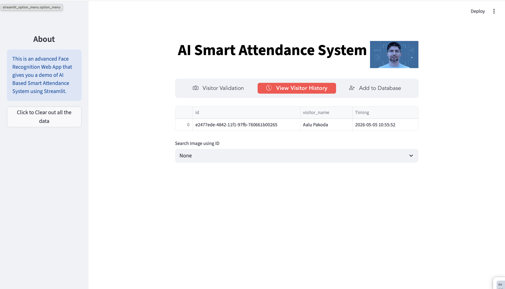

# 🎓 AI Smart Attendance System

An AI-powered face recognition attendance system built with Python and Streamlit. It uses real-time camera input or uploaded photos to identify registered faces, log attendance automatically, and maintain a searchable visitor history.

---

## 📸 Screenshots

> **Visitor Validation** — Take a live photo and instantly match faces against the database
<!-- Replace with your actual screenshot -->


> **Add to Database** — Register a new person by uploading or clicking a photo
<!-- Replace with your actual screenshot -->


> **Visitor History** — View and search all past attendance records
<!-- Replace with your actual screenshot -->


---

## ✨ Features

- 📷 **Live Camera Capture** — Use your webcam directly in the browser via Streamlit
- 🧠 **Face Recognition** — Powered by `dlib` + `face_recognition` for accurate identification
- 🗃️ **Visitor Database** — Register faces with names; stored as CSV + image files
- 📋 **Attendance Logging** — Automatically logs visitor name, ID, and timestamp on every match
- 🔍 **History Search** — Browse attendance records and look up captured photos by session ID
- 🧹 **One-Click Data Clear** — Reset the entire database and history from the sidebar
- 🎯 **Adjustable Similarity Threshold** — Tune match sensitivity per session using a slider
- 👥 **Multi-face Support** — Detect and match multiple faces in a single image

---

## 🗂️ Project Structure

```
Ai-Smart-Attendence/
├── app.py                  # Main Streamlit app
├── settings.py             # Config, helper functions, constants
├── requirements.txt        # Python dependencies
├── visitor_database/       # Registered face images + visitors_db.csv
└── visitor_history/        # Captured session images + visitors_history.csv
```

---

## ⚙️ Installation & Setup

### Prerequisites

- Python **3.9.x** (required — dlib wheels are version-sensitive)
- `cmake` installed via pip (see below)
- macOS: Xcode Command Line Tools (`xcode-select --install`)
- Windows: Visual C++ Build Tools

### 1. Clone the repository

```bash
git clone https://github.com/Shreeaanshsinghbisht/Ai-Smart-Attendence.git
cd Ai-Smart-Attendence
```

### 2. Create a virtual environment with Python 3.9

```bash
python3.9 -m venv venv

# macOS/Linux
source venv/bin/activate

# Windows
venv\Scripts\activate
```

### 3. Install cmake first (critical step)

```bash
pip install cmake==3.25.2
```

> ⚠️ Install `cmake` **before** the rest of the requirements. dlib's build system requires it to be present at install time.

### 4. Install dlib (version-pinned)

```bash
pip install dlib==19.24.2
```

### 5. Install remaining dependencies

```bash
pip install -r requirements.txt
```

### 6. Run the app

```bash
streamlit run app.py
```

Then open your browser at `http://localhost:8501`

---

## 🚀 How to Use

### ➕ Add to Database
1. Go to the **Add to Database** tab
2. Enter a name and either upload a photo or click one with your camera
3. Click **Save** — the face encoding is stored in `visitor_database/visitors_db.csv`

### ✅ Visitor Validation
1. Go to **Visitor Validation**
2. Take a photo using the camera input
3. Select the face(s) to validate and set a similarity threshold
4. Check **Proceed** — matched names appear overlaid on the image and attendance is logged

### 📜 View Visitor History
1. Go to **View Visitor History**
2. Browse the full attendance table sorted by most recent
3. Select a session ID from the dropdown to view the captured photo

---

## 🐛 Known Issues & Fixes

### `dlib` build failure on macOS (AppleClang 17 / Xcode 16)
**Error:** `fatal error: 'fp.h' file not found`  
**Fix:** Use `dlib==19.24.2` — do not use `dlib==20.x`

```bash
pip install cmake==3.25.2
pip install dlib==19.24.2
```

Reference: [dlib GitHub issue #2943](https://github.com/davisking/dlib/issues/2943)

---

### `StreamlitAPIException: Unrecognized config option: deprecation.showPyplotGlobalUse`
**Cause:** These config keys were removed in Streamlit 1.40+  
**Fix:** Remove these two lines from `app.py`:

```python
# Delete these:
st.set_option('deprecation.showPyplotGlobalUse', False)
st.set_option('deprecation.showfileUploaderEncoding', False)
```